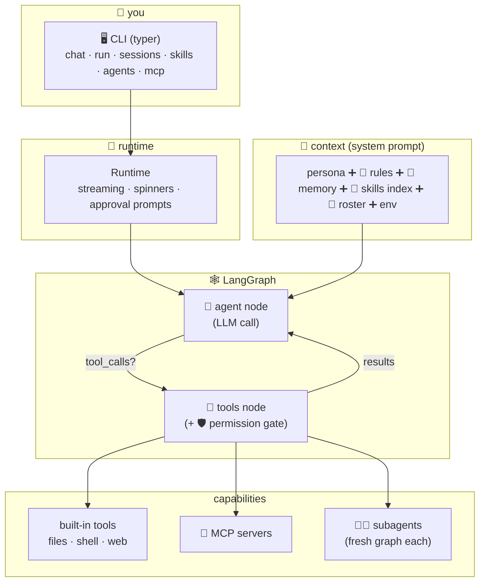

# 🤖 Talos

A **learning-first AI agent** built explicitly with [LangChain](https://python.langchain.com) + [LangGraph](https://langchain-ai.github.io/langgraph/) — small enough to read in an evening, complete enough to show how real agents (Claude Code, Cursor, Kiro…) actually work.

Every feature category a modern agent has, implemented minimally:

| Feature | Where | Docs |
|---|---|---|
| 🕸️ ReAct agent loop | `agent/graph/builder.py` | [02 — agent loop](docs/02-agent-loop.md) |
| 🔧 Tools (files/shell/web) | `tools/` | [03 — tools](docs/03-tools.md) |
| 🛡️ Permissions + `--yolo` | `infra/permissions.py` | [04 — permissions](docs/04-permissions.md) |
| 📜 Rules file (`TALOS.md`) | `agent/context.py` | [05 — context layers](docs/05-context-layers.md) |
| 🧠 Long-term memory | `memory.py` | [05 — context layers](docs/05-context-layers.md) |
| 💾 Sessions (resume) | `memory/sessions.py` | [05 — context layers](docs/05-context-layers.md) |
| ⌨️ Slash commands | `ui/commands.py` | [06 — commands & skills](docs/06-commands-and-skills.md) |
| 🎒 Skills (lazy knowledge) | `lifecycle/skills.py` | [06 — commands & skills](docs/06-commands-and-skills.md) |
| 🤖🤖 Subagents | `agents.py` + `tools/task_tool.py` | [07 — subagents](docs/07-subagents.md) |
| 🔌 MCP client | `integrations/mcp.py` | [08 — mcp](docs/08-mcp.md) |
| 🎙️ Interjections (ask/stop mid-task) | `agent/runtime.py` | [09 — interjections](docs/09-interjections.md) |
| 📇 Models, usage & cost | `integrations/models.py` | [10 — models & cost](docs/10-models-and-cost.md) |
| 🗺️ Plan mode (AI-DLC) | `lifecycle/planning.py` | [11 — plan mode](docs/11-plan-mode.md) |
| 🖥️ TUI (menu, streaming, banner) | `ui/tui.py`, `runtime/` | [12 — terminal UI](docs/12-terminal-ui.md) |
| ♾️ Compaction + graph memory | `memory/compaction.py`, `memory/graph_memory.py` | [13 — long-running](docs/13-long-running.md) |
| ⏪ Checkpoints · verifier · skill synthesis | `memory/checkpoints.py`, `lifecycle/skill_synthesis.py` | [14 — time travel](docs/14-time-travel.md) |
| 🔄 /evolve lifecycle | `lifecycle/evolve.py` | [15 — evolve](docs/15-evolve.md) |
| 🔗 Cross-agent linking · 👥 teams · 👁 vision · 🚧 policy · 🔭 tracing | various | see docs |

## 🚀 Quickstart

```bash
# install (uv or pip, your call)
pip install -e ".[dev]"          # + ".[mcp]" for MCP support

# point Talos at any OpenAI-compatible endpoint
cp .env.example .env             # then edit: base URL, API key, model

talos chat                       # 💬 interactive
talos run "summarize this repo"  # ⚡ one-shot
talos chat -n "fix the README"   # ⚡ one-shot, kiro-style --no-interactive
talos chat -r latest             # 💾 resume your last session
talos tui                        # 🖼️ full-screen Textual UI (pip install -e ".[tui]")
```

Works with OpenAI, Anthropic (`https://api.anthropic.com/v1/`), OpenRouter, Ollama (`http://localhost:11434/v1`), vLLM, LM Studio — same protocol, different `TALOS_BASE_URL`.

## 🗺️ The big picture



## 📚 Learn it commit by commit

The git history is a tutorial — each milestone is one self-contained feature:

```bash
git log --oneline        # M4 → M14, oldest at the bottom
git checkout <hash>      # time-travel to any milestone and poke around
```

| Milestone | What you'll learn |
|---|---|
| M4 | provider-agnostic LLM config (one `ChatOpenAI`, any endpoint) |
| M5 | the ReAct loop: state, reducers, conditional edges, token streaming |
| M6 | tool design: schemas from docstrings, output truncation |
| M7 | human-in-the-loop: a permission gate the model can't bypass |
| M8 | context layering: rules vs memory vs sessions |
| M9 | terminal UX: spinners that stop at the first streamed token |
| M10 | slash commands (client-side) + skills (lazy-loaded knowledge) |
| M11 | prompt-injection defense in depth |
| M12 | subagents: context isolation + tool scoping |
| M13 | MCP: pluggable external tools |
| M14 | these docs |
| M15–M16 | SSL toggle, crash-safe sessions, live markdown, /mermaid |
| M17–M20 | usage tracking, pydantic models, 8-bit banner, interjections |
| M21–M25 | environment/shell awareness, session titles, /models + cost, /plan (AI-DLC), reasoning |
| M26–M28 | prompt_toolkit input, animated banner, kiro-style inline command menu |
| M29–M32 | conversation chrome, /models hang+pricing fixes, Textual TUI |
| M33–M38 | auto-compaction, GraphRAG memory, time-travel /rewind, verifier, policy+sandbox, OTel tracing |
| M39–M44 | cross-agent linking, skill synthesis, parallel teams, vision, /init, /evolve ouroboros |

Start at [docs/01-config.md](docs/01-config.md) → each guide links the next.

## 📁 Layout

```
src/talos/
  cli.py          🖥️ typer commands
  config.py       ⚙️ settings (.env, TALOS_* env vars)
  agent/llm.py          🔌 ChatOpenAI factory
  agent/context.py      🧠 system-prompt assembly (rules+memory+skills+agents)
  infra/permissions.py  🛡️ the gate
  memory.py  memory/sessions.py  lifecycle/skills.py  ui/commands.py  agents.py  integrations/mcp.py
  agent/graph/          🕸️ state + builder (the loop itself)
  runtime/        🏃 streaming runner + TUI
  tools/          🔧 files · shell · web · memory · skill · task
tests/            🎭 offline tests with a scripted fake LLM
.talos/           project-local agent config (agents, commands, skills…)
```

## 🧪 Tests

```bash
python -m pytest tests/ -q     # 27 tests, all offline — no API key needed
```
