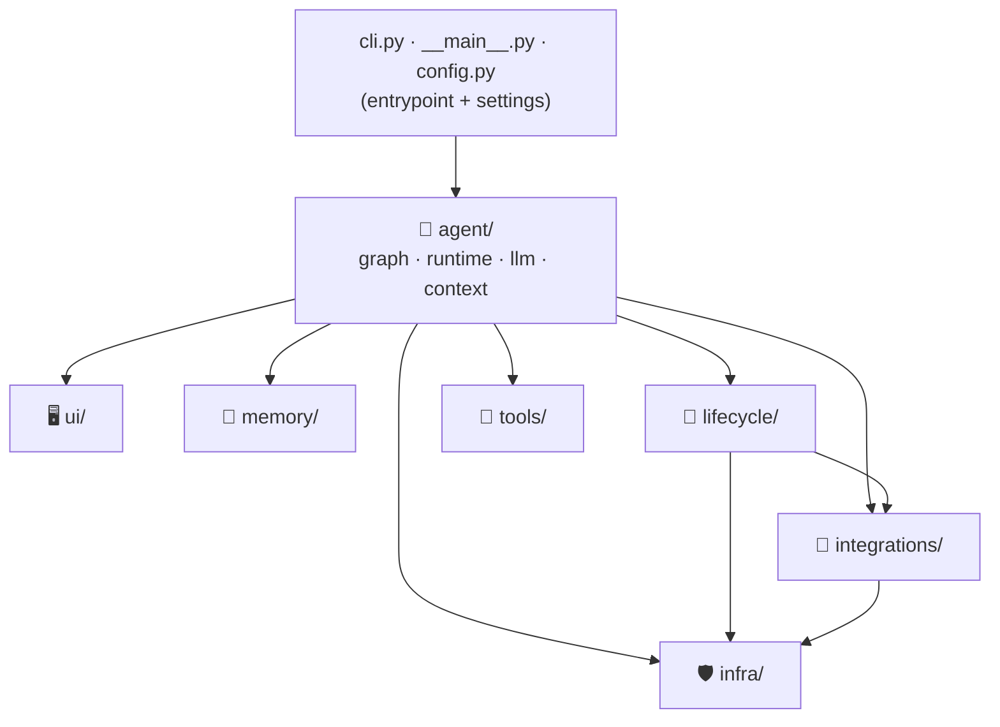

# 00 · 🏛️ Project structure

> The "where does code live" decisions · Milestone: M46 · Next: [01 — config](01-config.md)

Talos doubles as a teaching repo *and* a production-shaped agent, so its
layout is deliberate. The vocabulary, since people conflate these:

- **project layout / project structure** — the repo-level arrangement of
  files and folders.
- **src layout** — putting the package under `src/` (vs a "flat layout"
  with the package at the repo root). It's the modern Python packaging
  standard: it forces you to test the *installed* package, not the source
  tree sitting on `sys.path`, catching "works on my machine" packaging
  bugs.
- **package by feature, not by layer** (a.k.a. *screaming architecture*) —
  the principle behind the subpackages below.

## Package by feature

A junk-drawer `utils/`, `helpers/`, or type-named `models/` folder tells
you nothing about what the app *does*. Talos instead groups by capability,
so the folder list reads like a feature list:

## The one-way dependency rule

The arrows above point *down* and never back up. `infra/` (permissions,
policy, tracing) and `integrations/` (mcp, models) know nothing about
`lifecycle/` (planning, evolve) — but `lifecycle/` may use them. The
orchestrator, `agent/runtime.py`, sits on top and may import anything.

Why it matters: when dependencies form an acyclic graph, you can read,
test, and change any layer without tracing a tangle. A cycle (A imports B
imports A) is the first sign a refactor has gone wrong. Talos has none —
`python -c "import talos.cli"` would fail loudly on an import cycle.

## Entrypoints

`pyproject.toml` declares `talos = "talos.cli:app"` — the **console-script
entrypoint**, the installable-package equivalent of the `main.py` you see
in app-style repos. `__main__.py` adds `python -m talos`. So there's no
loose `main.py`; the entrypoint is declared, which is the packaged-library
convention.

## Imports stay explicit

Internally Talos uses canonical paths (`from talos.memory.compaction
import compact`) rather than magic re-exports from `__init__.py`. It's a
few more characters, but a newcomer can follow any import straight to the
file — no indirection, and no risk of the import cycles that
re-export-everything `__init__.py` files invite.
