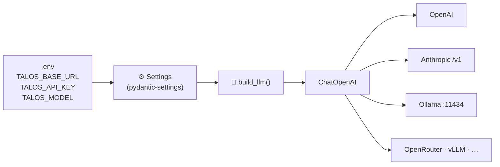

# 01 · ⚙️ Configuration & the provider trick

> Previous: [00 — project structure](00-project-structure.md)

> Files: `config.py`, `agent/llm.py`, `.env.example` · Milestone: M4 · Next: [02 — agent loop](02-agent-loop.md)

## One class, every provider

Talos never imports `langchain_anthropic`, `langchain_ollama`, etc. It uses a single `ChatOpenAI` because nearly every inference provider speaks OpenAI's HTTP protocol. Switching providers = changing two strings in `.env`:



## How settings load

`pydantic-settings` resolves each field in priority order:

1. real environment variables — `TALOS_MODEL=gpt-5 talos chat`
2. the `.env` file in the current directory
3. defaults in `config.py`

The `TALOS_` prefix is stripped, so `TALOS_BASE_URL` → `settings.base_url`. One shared `settings` instance is imported everywhere — a deliberate "import-time singleton" pattern: simple, and testable because tests just set env vars or chdir.

## 🔓 Behind a corporate proxy?

If your network re-signs TLS traffic you'll see certificate errors. Two fixes, best first:

1. keep verification on and trust the proxy CA: `SSL_CERT_FILE=C:\path\to\proxy-ca.pem`
2. last resort: `TALOS_VERIFY_SSL=false` in `.env` — disables certificate checks for LLM + `web_fetch` traffic, which means anyone on the network path can read/alter it. Don't use it outside the proxy'd network.

## Things to try

```bash
talos config                     # see the effective settings, key masked
TALOS_MODEL=other talos config   # env var beats .env
```
