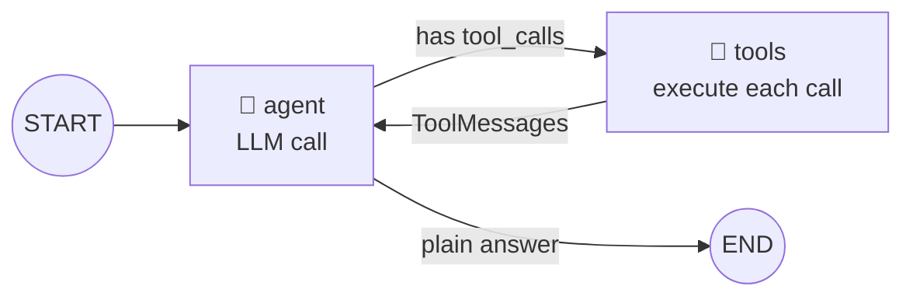
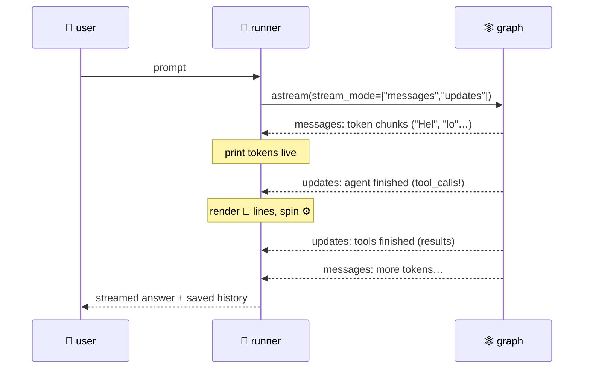

# 02 · 🕸️ The agent loop (ReAct)

> Files: `agent/graph/state.py`, `agent/graph/builder.py`, `agent/runtime.py` · Milestone: M5 · Next: [03 — tools](03-tools.md)

## The whole idea of an "agent" in one diagram

An agent is an LLM in a loop: it *thinks* (one model call), optionally *acts* (tool calls), sees the results, and thinks again — until it answers in plain text.



That's `build_agent_graph()` — two nodes and one conditional edge. Everything else in every agent framework is decoration around this loop.

## State & reducers

Nodes don't mutate shared state; they **return updates** and LangGraph merges them with a *reducer*. Our state is just messages, and the `add_messages` reducer appends instead of replacing:

```python
class AgentState(BaseModel):
    messages: Annotated[list[AnyMessage], add_messages]
```

A full turn through the loop produces a message pattern like:

```
Human("rename foo to bar")
AI(tool_calls=[grep(...)])      ← think
Tool("src/x.py:12: foo…")       ← act
AI(tool_calls=[edit_file(...)]) ← think
Tool("Edited src/x.py")         ← act
AI("Done — renamed in 1 file")  ← final answer, loop exits
```

## Streaming

The runner subscribes to two LangGraph stream views at once:



- `messages` mode = raw LLM token chunks → live text
- `updates` mode = each node's finished output → tool activity + history

## Guard rails

The loop can't run forever: `recursion_limit` (from `TALOS_MAX_ITERATIONS`) caps super-steps, and `GraphRecursionError` is caught and reported instead of crashing.
