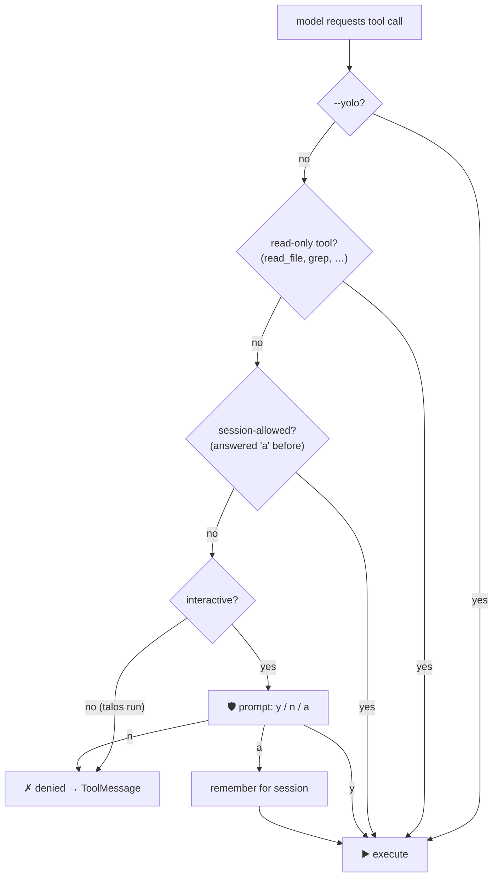

# 04 · 🛡️ Permissions

> File: `infra/permissions.py` · Milestone: M7 · Next: [05 — context layers](05-context-layers.md)

## Where the gate sits

The gate is injected into the **tools node**, not suggested to the model. The model literally cannot bypass it — a denial just becomes a `ToolMessage` it can read and adapt to:

## The rules

- **Read-only tools run free** — they can't break anything.
- **Mutating tools ask a human** in chat (`y` once, `a` for the session, `n` deny).
- **One-shot runs deny by default** — there's nobody to ask. `--yolo` (same idea as `--dangerously-skip-permissions`) switches the gate off; so does `TALOS_YOLO=true`.
- **Subagents and MCP tools** go through the same gate: MCP tool names aren't in the read-only list, so they require approval automatically.

This is the single most important safety feature an agent has — injection, hallucination, or plain bad judgment all bottleneck here.
