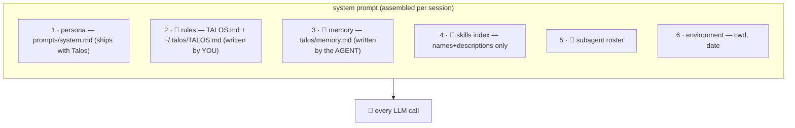

# 05 · 🧠 Context layers — rules, memory, sessions

> Files: `agent/context.py`, `memory.py`, `memory/sessions.py` · Milestone: M8 · Next: [06 — commands & skills](06-commands-and-skills.md)

## The layered system prompt

LLMs are stateless; agents fake continuity by *assembling context* before every call. `build_system_prompt()` stacks:



The same pattern as `CLAUDE.md` / `AGENTS.md` / `.cursorrules`: **stable instructions live in files, not chat history** — history gets long, files stay cheap.

## Rules vs memory — who writes it?

| | 📜 rules (`TALOS.md`) | 🧠 memory (`.talos/memory.md`) |
|---|---|---|
| author | the human | the agent (via `save_memory` tool) |
| content | constraints, conventions | learned facts, preferences |
| example | "never push to main" | "(2026-06-10) user prefers pytest" |

## 💾 Sessions

Every chat auto-saves its message list to `~/.talos/sessions/<id>.json` (LangChain's message serializers — `ToolMessage`s and all). Pre-M60, this lived at `./.talos/sessions/` cwd-local; see [21 — sessions](21-sessions-and-search.md) for the migration story.

```bash
talos sessions          # list
talos chat -r latest    # resume right where you left off
talos chat -r 20260610-153012
```

Inside a chat, `/clear` resets the in-memory history (the file keeps the old turns until the next save).

Sessions are also the **crash-recovery** mechanism: history is saved after every turn, and API failures (expired key, SSL trouble, dead network) are caught instead of killing the REPL. Fix `.env`, then `talos chat -r latest` puts you right back in the conversation.
