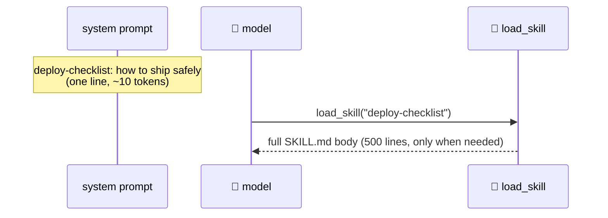

# 06 · ⌨️ Slash commands & 🎒 skills

> Files: `ui/commands.py`, `lifecycle/skills.py`, `tools/skill_tool.py` · Milestone: M10 · Next: [07 — subagents](07-subagents.md)

Two extension mechanisms that look similar but answer to different masters:

| | ⌨️ commands | 🎒 skills |
|---|---|---|
| triggered by | the **human** types `/name` | the **model** calls `load_skill` |
| lives in | `.talos/commands/<name>.md` | `.talos/skills/<name>/SKILL.md` |
| is | a reusable prompt template | lazy-loaded knowledge |

## ⌨️ Commands

Built-ins (`/help`, `/clear`, `/tools`, `/memory`, `/exit`) are handled client-side — the model never sees them. Custom commands are markdown templates with `$ARGUMENTS` substitution:

```markdown
<!-- .talos/commands/review.md -->
Review the following code for bugs…

$ARGUMENTS
```

`/review src/cli.py` → the expanded text is sent as a normal user message.

## 🎒 Skills

The trick that makes skills cheap — **only the index goes in the system prompt**, bodies load on demand:



```markdown
<!-- .talos/skills/deploy-checklist/SKILL.md -->
---
name: deploy-checklist
description: Step-by-step deploy procedure for this project
---
1. run the test suite …
```

Rules are *always* loaded; skills are the *lazy* counterpart. That's the entire distinction.
