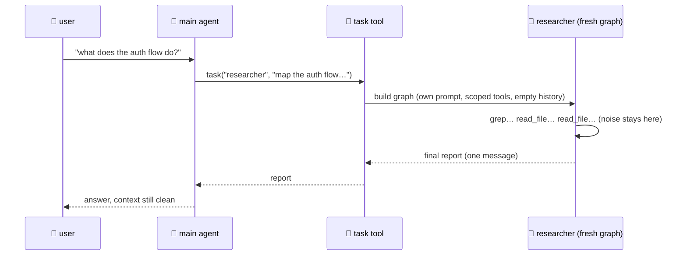

# 07 · 🤖🤖 Subagents

> Files: `agents.py`, `tools/task_tool.py` · Milestone: M12 · Next: [08 — mcp](08-mcp.md)

## Why delegate?

- **context isolation** — research that reads 50 files burns the *subagent's* context; the main thread receives one tidy report
- **role separation** — a dedicated "find problems" prompt beats a generalist
- **tool scoping** — the reviewer doesn't get `shell`



## Defining one

```markdown
<!-- .talos/agents/researcher.md -->
---
name: researcher
description: Reads code and docs, answers with file:line citations
tools: read_file, list_dir, glob_files, grep, web_fetch
model: gpt-4o-mini        ← optional, defaults to the main model
---
You are a research specialist… (this becomes its system prompt)
```

The roster (names + descriptions) is injected into the main agent's system prompt so it knows who it can call. `talos agents` lists them.

## Safety properties

- subagents never receive the `task` tool → **no recursive delegation**
- they run non-interactively → mutating tools are denied by the gate (unless `TALOS_YOLO`)
- empty `tools:` = safe read-only default set
