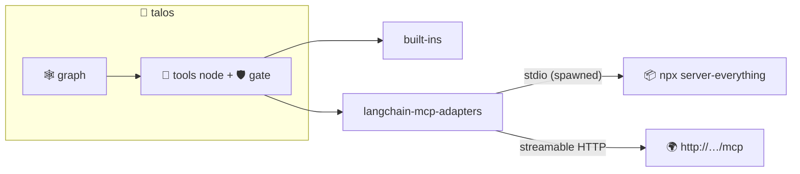

# 08 · 🔌 MCP — Model Context Protocol

> File: `mcp.py` · Milestone: M13 · Previous: [07 — subagents](07-subagents.md)

## What it is

Skills are knowledge, tools are capability, **MCP is connectivity**: a standard protocol that lets any tool server (GitHub, Slack, Postgres, filesystem, …) plug into any agent that speaks it. Talos uses `langchain-mcp-adapters` to turn remote MCP tools into ordinary LangChain tools.



## Configuration

`.talos/mcp.json`, same shape as Claude Desktop / Cursor:

```json
{
  "mcpServers": {
    "everything": { "command": "npx", "args": ["-y", "@modelcontextprotocol/server-everything"] },
    "remote":     { "url": "http://localhost:8000/mcp" }
  }
}
```

`command` → spawned stdio subprocess · `url` → streamable HTTP. Transport is inferred; install with `pip install -e ".[mcp]"`.

```bash
talos mcp     # list servers + the tools they expose
talos chat    # 🔌 N MCP tool(s) connected
```

## Trust model

MCP tools are **third-party code**. They aren't on the read-only allowlist, so the 🛡️ permission gate prompts before every call — the same human-in-the-loop that protects against prompt injection protects against overeager servers.
