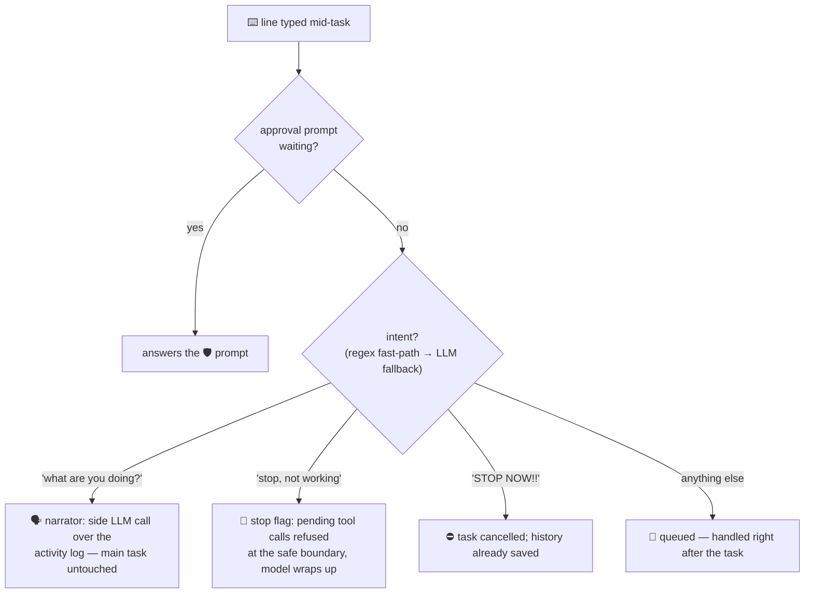

# 09 · 🎙️ Interjections — talking to a busy agent

> Files: `runtime/runner.py` (pump, classifier, narrator), `graph/builder.py` (stop flag) · Milestone: M20

Type while Talos works; what you say determines what happens:

## The three mechanisms worth studying

**One stdin owner.** To hear you while working, *someone* must always be
reading stdin — and two readers would race for keystrokes. So a single
background thread pumps lines into an `asyncio.Queue`, and whoever
currently owns input (prompt, approval dialog, interjection loop) takes
from it. EOF becomes a sticky flag, not a poison pill — piped input
(`echo "task" | talos chat`) still works.

**Safe-boundary stops.** "Graceful" has a precise meaning: the stop flag
is checked **between tool calls** in the tools node — never mid-write.
Refused calls return a notice the model reads, so it wraps up and
summarizes instead of vanishing. Urgent stops just cancel the asyncio
task; the `finally` block has already saved the session either way
(`talos chat -r latest` to revisit).

**Side-channel narration.** "What are you doing?" is answered by a
*separate* LLM call over the turn's activity log — the main graph never
pauses. Two model calls in flight at once, one terminal: rich's `Live`
lets the panel print above the streaming region.

Intent detection is two-tier: regexes catch the obvious (free, instant),
an LLM one-word classifier handles the ambiguous, and uncertainty
defaults to "queue it" — the least disruptive wrong answer.
