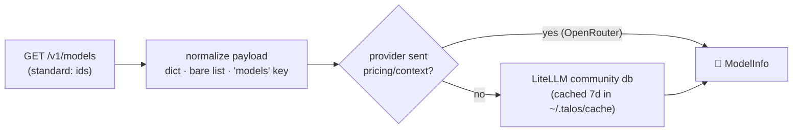

# 10 · 📇 Models, usage & cost

> Files: `models.py`, parts of `runtime/runner.py`, `sessions.py` · Milestones: M17, M22, M23 · Next: [11 — plan mode](11-plan-mode.md)

## What's standard, what isn't

`GET /v1/models` exists on every OpenAI-compatible provider — but the spec
only promises `id`/`owned_by` (and not even the envelope is safe: Anthropic's
compat layer returns a bare JSON list). The fields everyone wants —
`max_input_tokens`, `input_cost_per_token`, `supports_vision` — are
**extensions**, served by OpenRouter and LiteLLM proxies only.

`/models` in chat lists id · context · $/M in/out · 👁 vision and switches
the session's model in place — same conversation, different brain.

## Tracking usage

Every provider returns usage; LangChain normalizes it into
`AIMessage.usage_metadata` regardless of vendor. Talos sums it per turn and
per session, prices it via the same db, and shows it three ways: on the
spinner while working, as a dim footer per turn, and via `/usage`
(session + all-time, accumulated in `sessions/index.json`).

The expensive subtlety: `input_tokens` counts the **whole context every
call**, so one agentic turn with five think→act steps re-bills the
conversation prefix five times. That's why context discipline — subagents,
lazy skills — is a cost feature, not just hygiene.
