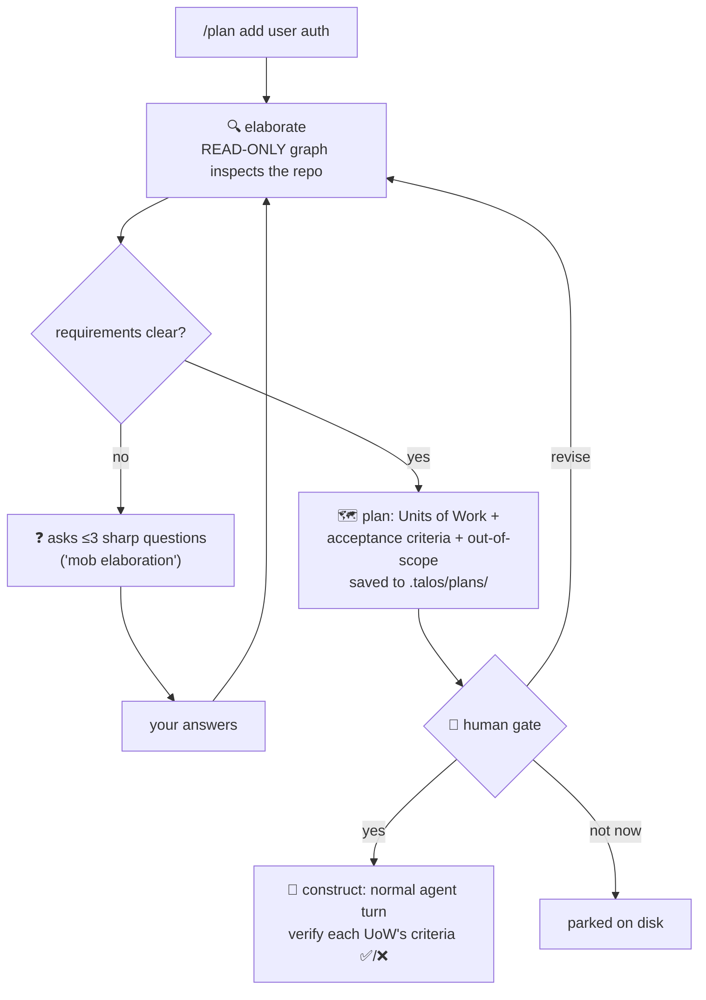

# 11 · 🗺️ Plan mode (AI-DLC)

> File: `planning.py` + `run_plan()` in `runtime/runner.py` · Milestone: M24 · Next: [12 — terminal UI](12-terminal-ui.md)

AWS's **AI-DLC** (AI-Driven Development Lifecycle) reframes agent work: the
AI *drives* — planning, asking, proposing — and the human *approves at
gates*. Work is sliced into **Units of Work** run in short "bolts".
`/plan <task>` is that loop in single-player form:

Design choices worth noticing: elaboration runs on a **separate graph with
read-only tools** — planning physically cannot mutate anything, the same
trick subagents use. And construct is just a regular turn, so the
permission gate and interjections still apply. The relationship to the
RPI (research-plan-implement) pattern: elaborate *is* research+plan,
construct *is* implement — AI-DLC adds the human gates and the UoW
vocabulary around it.

The system prompt also tells the model to *suggest* planning when a task
spans multiple files or >3 steps — agents that know when to slow down
are the trend Kiro/AI-DLC represent.
