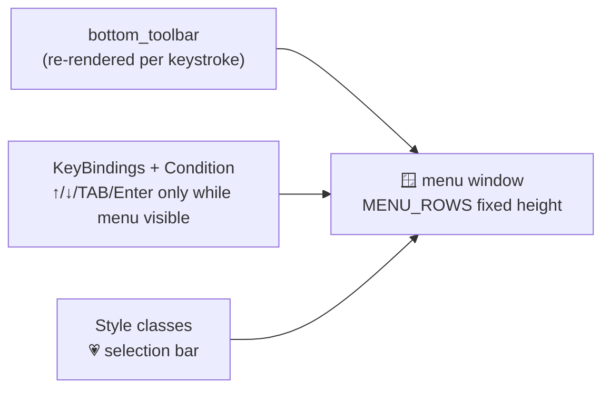

# 12 · 🖥️ Terminal UI engineering

> Files: `runtime/runner.py`, `tui.py`, `banner.py` · Milestones: M9, M16, M19, M25–M28

A CLI agent is still a *product* — these are the TUI techniques Talos uses
and where to read them:

**Streaming pipeline** (`runner.turn`): a spinner runs whenever the agent
is busy and dies at the first token; markdown re-renders live through
`rich.Live` as the buffer grows; tool calls print as dim one-liners; 🧠
reasoning tokens (the `reasoning_content` side channel) render dim+italic
above the answer. The golden rule: only one thing may own the live region
at a time — `close_stream()` enforces the handoffs.

**One input owner** (`make_pump`): stdin has exactly one reader for the
whole session. On real terminals that's a persistent prompt_toolkit prompt
(history, editing, paste detection); for pipes/CI it degrades to a plain
reader thread. Everything else — approval dialogs, /plan questions,
interjections — consumes from the same queue.

**The inline command menu** (`tui.py`): type `/` and suggestions render in
a **fixed window under the prompt** — kiro-style, no popup. ↑/↓ move a 💗
highlight, the window scrolls in place, a `+N more` tail updates as you
move, TAB/Enter accept. Built from three prompt_toolkit primitives:

Two hard-won lessons baked into the code: key handlers that change UI
state without changing the buffer must call `app.invalidate()` or nothing
repaints; and ordering matters — the banner's animation must finish
*before* the prompt (and `patch_stdout`) start, or every frame re-prints
as a separate block.

**The banner** (`banner.py`): half-block pixel art (each cell = two
pixels), centered, with a molten-bronze gradient sweep on a 24fps
`rich.Live` — skipped when stdout isn't a terminal so pipes stay clean.
