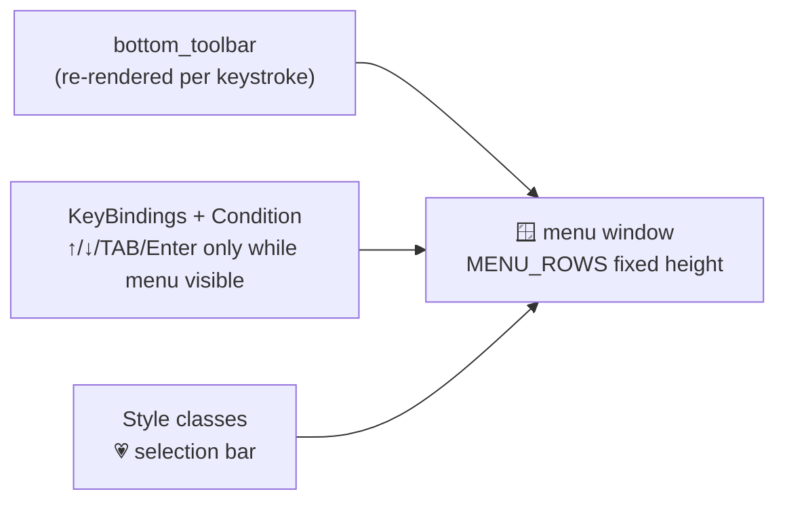

# 12 · 🖥️ Terminal UI engineering

**Input UX** (M48): the CLI prompt is a left ▏ rule (no arrow). Multi-line
is **Alt+Enter** (also Ctrl+J) to add a line, Enter to submit — Shift+Enter
is indistinguishable from Enter in most terminals, so Alt+Enter is the
portable newline. On submit the prompt erases (`erase_when_done`) and the
message is reprinted in a bordered "you" panel, rendered as **markdown** so
pasted ```code``` fences and `inline code` display properly — and the
border is the clean separation from the agent's reply below.


> Files: `agent/runtime.py`, `ui/tui.py`, `ui/banner.py` · Milestones: M9, M16, M19, M25–M28

A CLI agent is still a *product* — these are the TUI techniques Talos uses
and where to read them:

**Streaming pipeline** (`runner.turn`): a spinner runs whenever the agent
is busy and dies at the first token; markdown re-renders live through
`rich.Live` as the buffer grows; tool calls print as dim one-liners; 🧠
reasoning tokens (the `reasoning_content` side channel) render dim+italic
above the answer. The golden rule: only one thing may own the live region
at a time — `close_stream()` enforces the handoffs.

**One input owner** (`make_pump`): stdin has exactly one reader for the
whole session. On real terminals that's a persistent prompt_toolkit prompt
(history, editing, paste detection); for pipes/CI it degrades to a plain
reader thread. Everything else — approval dialogs, /plan questions,
interjections — consumes from the same queue.

**The inline command menu** (`ui/tui.py`): type `/` and suggestions render in
a **fixed window under the prompt** — kiro-style, no popup. ↑/↓ move a 💗
highlight, the window scrolls in place, a `+N more` tail updates as you
move, TAB/Enter accept. Built from three prompt_toolkit primitives:



**Status without flicker** (M30): the agent's "thinking" indicator no
longer draws via rich while the prompt is active — two renderers fighting
over the bottom line is exactly where flicker comes from. Instead the
Runtime writes plain text into a shared `StatusState`, and the prompt's
own bottom toolbar renders it (with a custom ⚒ forge spinner — sparks
fly off the hammer), animated by `refresh_interval`. One owner of the
screen bottom, zero flicker, and your in-flight typing never collides
with the spinner. The menu takes the toolbar over while you're picking
a command; the status returns when you're not.

Two hard-won lessons baked into the code: key handlers that change UI
state without changing the buffer must call `app.invalidate()` or nothing
repaints; and ordering matters — the banner's animation must finish
*before* the prompt (and `patch_stdout`) start, or every frame re-prints
as a separate block.

**Flicker-free streaming & clean separation** (M47): the prompt is
**turn-based** — prompt_toolkit runs only *between* turns to read a line
(with the inline menu); during streaming there is NO pinned prompt and NO
`patch_stdout`. Tokens print **append-only** straight to the terminal, so
the user's input line stays above and the agent's answer streams below
with the `▌⚒ talos` header between them. This kills three bugs at once:
the flicker (rich.Live / patch_stdout were repainting every token), the
"top lines duplicated ×30" (Live can't erase what scrolled off-screen),
and the cursor pinned in the stream. Markdown is re-rendered only when the
answer still fits on screen (safe cursor-up clear); longer answers stay as
the plain stream. A fallback renders the whole answer if a provider
doesn't stream tokens. "Type while it works" interjections are now opt-in
(`TALOS_INTERJECT=true`), since they require a pinned prompt.

**Conversation chrome** (M29): the user's line is a golden `→` with the
input text warm-highlighted and a ▮ block cursor (`CursorShape.BLOCK`);
the agent answers under a `▌⚒ talos · model` header — that bar/header
pair is the user/agent split. Session stats (total tokens · $ cost,
3 decimals, costs coalesced to 0 when a side is unknown) live in the
prompt's **rprompt** — pinned to the right edge of the input line,
always current, never printed into the transcript. The lesson: status
belongs in *chrome* (re-rendered UI), history belongs in the
*transcript* — mixing them is what makes CLI conversations unreadable.

**The Textual edition** (`ui/tui_app.py`, M31): `talos tui` is the same
brain behind a full-screen [Textual](https://textual.textualize.io)
app — a real right sidebar (model · tokens · cost, always visible),
styled user/agent chat blocks, modal permission dialogs, Esc for a
graceful stop. The trade it makes: Textual owns the whole screen, so
you lose native scrollback and pipe-friendliness — which is exactly why
`talos chat` (prompt + stream) stays the default. The architectural
proof: `ui/tui_app.py` imports only UI-free modules (graph, sessions,
models, permissions, context). Two faces, one brain — if your rendering
layer can't be swapped, it was never a layer.

**The banner** (`ui/banner.py`): half-block pixel art (each cell = two
pixels), centered, with a molten-bronze gradient sweep on a 24fps
`rich.Live` — skipped when stdout isn't a terminal so pipes stay clean.
