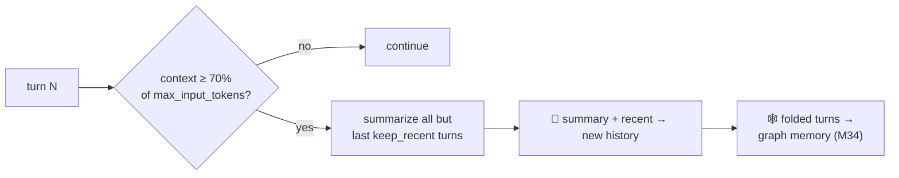
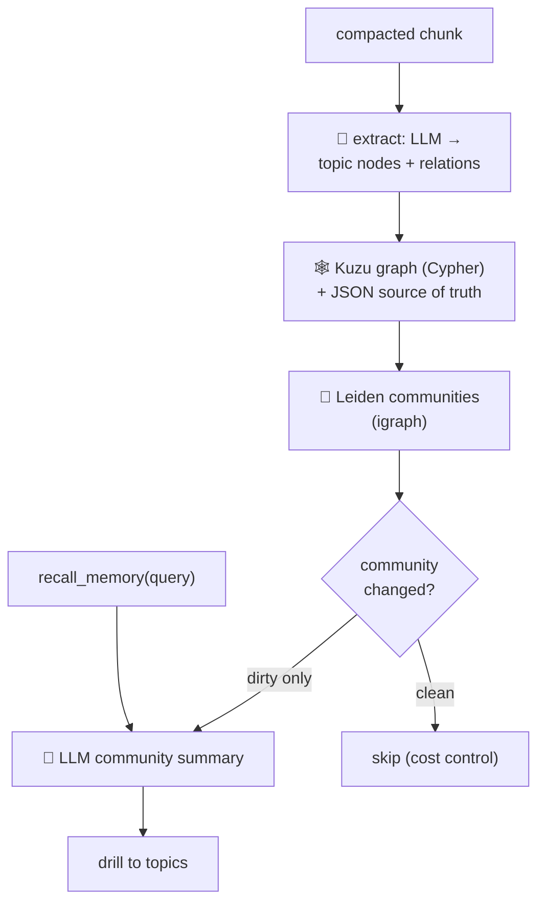

# 13 · ♾️ Long-running: compaction + graph memory

> Files: `compaction.py`, `graph_memory.py` · Milestones: M33, M34 · Next: [14 — time travel](14-time-travel.md)

The two features that turn Talos from "stateless per session" into an
agent that never runs out of context.

## 🗜️ Compaction (M33)

Every LLM call re-sends the whole history, so a long session eventually
overflows the window and re-bills the prefix each step. Compaction folds
old turns into a summary when context fills up.

The trigger is **exact, not estimated**: the provider reports
`input_tokens` with every reply — the real size of the context it just
read — and we know the model's `max_input_tokens` from `/models`.

Tool calls are never split from their results; an existing summary is
merged, not duplicated; the summary call is metered. A `▰▱` fuel gauge in
the rprompt shows how full the context is.

## 🕸️ Graph memory (M34)

Folded turns don't vanish — they flow into a GraphRAG knowledge graph
(Microsoft's *From Local to Global*, 2024):

The **cost control** is dirty-tracking: a community is re-summarized only
when its membership changes — one LLM call per dirty community per
compaction, all metered. `recall_memory` lets the agent answer about
topics from far behind the compaction horizon; with Kuzu installed it can
also run text2cypher. Everything heavy is optional (`pip install
'talos[memory]'`) and degrades to in-memory logic without it.
