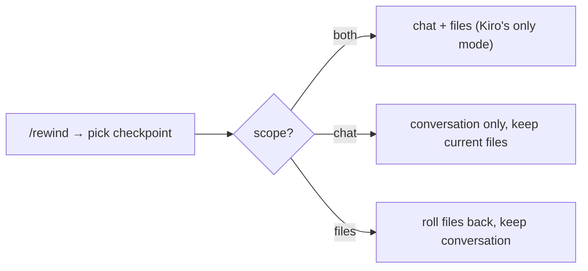

# 14 · ⏪ Time travel, verification & self-improvement

> Files: `memory/checkpoints.py`, `lifecycle/planning.py`, `lifecycle/skill_synthesis.py` · Milestones: M35, M36, M40

## ⏪ Checkpoints (M35)

After every turn, two snapshots: the message list, and a **file** snapshot
captured as a tree object in a *shadow* git repo (`.talos/checkpoints/
shadow`) — content-addressed dedup for free, the user's real git history
never touched. `/rewind` restores with a **scope choice** Kiro lacks:

## 🔍 Verifier (M36)

The judge pattern: after a `/plan` construct phase, a *separate* skeptical
LLM call scores each Unit of Work against its acceptance criteria over the
real conversation, rendering a ✅/❌ table. "Passed" requires concrete
evidence — uncertainty fails closed.

## 🧪 Skill synthesis (M40)

`/learn` distills a finished task into a reusable SKILL.md — the Voyager
loop. The 2026 lesson baked in: **verify before save**. A candidate must
parse *and* pass a self-review pass (sound, safe, generalizable, not
hallucinated) before joining `.talos/skills`. An unverified skill is as
likely to mislead as help.
