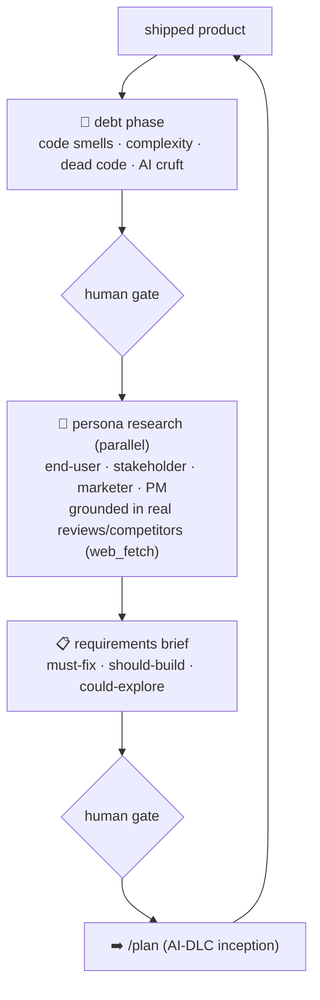

# 15 · 🔄 /evolve — the AI-DLC ouroboros

> Files: `evolve.py` + `run_evolve()` · Milestone: M44 (capstone)

The research has every piece but nobody published the closed loop. `/evolve`
is the whole product lifecycle as a gated cycle on top of AI-DLC:

**Grounding is the design's spine.** Tech-debt analysis leans on the 2026
finding that >90% of issues in AI-written code are smells ([ACE](https://arxiv.org/html/2507.03536v1),
[RefAgent](https://arxiv.org/pdf/2511.03153)). Persona research is
GROUNDED in fetched evidence — real reviews and competitor pages, never
hallucinated agreement — the [PersonaCite](https://arxiv.org/pdf/2601.22288)/
[Elicitron](https://www.researchgate.net/publication/386895033) lesson.
Every phase is human-gated: AI-DLC's approval discipline applied to the
whole lifecycle, not one feature.

It reuses everything: parallel personas via M41 teams, SonarQube via an
M39-linked MCP, the M24 planner and M36 verifier on the handoff.
