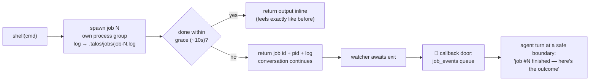

# 16 · 📟 Background jobs & the callback door

> Files: `tools/jobs.py`, `tools/shell.py`, `runtime/runner.py` · Builds on: [09 — interjections](09-interjections.md)

Interjections (doc 09) let you *talk* while the agent works — but a long
shell command still froze the whole turn: `tools_node` awaited the
subprocess, so nothing moved until it returned. Now **every shell command
is a tracked job**, and long ones stop blocking the loop entirely.

## 🐚 One tool, two speeds

Fast commands (`ls`, `git status`) feel synchronous. Anything slower —
builds, test suites, installs — keeps running while you keep talking.
Mid-flight you can ask the agent to `job_status(N)` (tails the log and
flags a log that stopped growing — the hang detector) or `job_kill(N)`
(kills the whole process tree).

## 🚪 The callback door

Completion never types into your prompt. The watcher pushes the finished
job onto `Runtime.job_events`; the REPL's idle wait races that queue
against your input, so:

- if you're **idle**, the completion wakes the loop and the agent reports
  the outcome in a normal turn
- if you're **mid-sentence**, the report prints *above* the persistent
  prompt (prompt_toolkit owns the bottom line) — your half-typed text is
  untouched, and the agent invites you to finish your thought
- if the agent is **mid-turn**, the event waits for the safe boundary,
  exactly like queued interjection notes

## 🧟 No orphans

Every spawn lands in a registry (`.talos/jobs/registry.json`) with its
pid. Session end reaps everything still running; an `atexit` hook is the
crash backstop; and if a session dies hard anyway, the next one reads the
breadcrumb and warns you about pids it can no longer vouch for (warn, not
kill — pids get reused). One-shot runs (`talos run`) wait briefly for
stragglers instead of orphaning them.

Policy and permissions are unchanged: the tool is still named `shell`, so
deny rules and the approval gate apply exactly as before; `job_status` /
`job_kill` ride free because they only touch what this session spawned.
