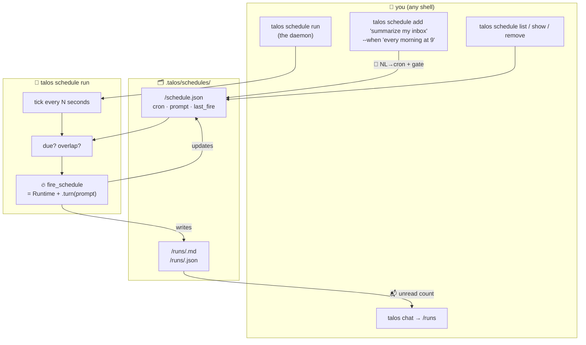

# 16 · 📅 Scheduled tasks

> Files: `lifecycle/scheduling.py`, `cli.py` (the `schedule` sub-typer), `ui/banner.py`, `ui/commands.py` · Milestones: M49–M51

Talos so far has been a *you-press-enter* agent — `talos chat` and
`talos run` both wait for a human to type. A lot of useful agent work is
recurring though: *every morning summarize what landed in my inbox*,
*every Monday at 9 write the standup from last week's commits*. That's
what M49–M51 add: a tiny in-process scheduler that fires Talos prompts
on a cron schedule and stores every fire on disk so you can pick the
results up next time you open chat.

## 🗺️ The shape of it



## ⚙️ Storage layout

Each schedule is **one folder** under `.talos/schedules/<id>/`, mirroring
the per-thing pattern used by sessions, skills, agents, and checkpoints.
Inside:

```
.talos/schedules/morning-summary/
  schedule.json                       # the schedule itself + bookkeeping
  runs/
    2026-06-15T09-00-00.md            # human-readable transcript
    2026-06-15T09-00-00.json          # structured record (read flag, usage, …)
    2026-06-16T09-00-00.md
    …
```

`schedule.json` is a pydantic `Schedule` model — validated on load so a
hand-edited file fails loudly at startup instead of mysteriously at fire
time. `removeschedule()` deletes only the `schedule.json`; the `runs/`
folder is preserved so an accidental remove doesn't wipe historical
context.

## 🗣️ Natural language → cron, with a human gate

You can pass a cron directly:

```bash
talos schedule add "summarize my inbox" --cron "0 9 * * *"
```

…or write it in English and Talos translates it via the LLM at create
time:

```bash
talos schedule add "summarize my inbox" --when "every morning at 9"
# 🗣️  parsing 'every morning at 9' via the model…
# 📅 resolved cron: 0 9 * * *
# next fires:
#   → 2026-06-16 09:00
#   → 2026-06-17 09:00
#   → 2026-06-18 09:00
# save this schedule? [Y/n] ›
```

That confirmation step is the same human gate the `/plan` flow uses —
the LLM proposes, the human accepts. The resolved cron is validated
through croniter before saving, so a hallucinated expression fails right
there instead of being saved and failing every minute at fire time.

`--when` tries cron syntax first (fast, no LLM round-trip) before
falling back to the model. `--cron` skips the LLM entirely. `--yes`
skips the gate for scripting.

## ⏰ The daemon

```bash
talos schedule run                    # ticks every 30s by default
talos schedule run --tick 5           # tighter loop for development
talos schedule run --once             # one tick, for cron-driven setups
```

`daemon_loop()` wakes on each tick, re-reads `.talos/schedules/` from
disk (so an `add` from another shell is picked up without restart), and
checks every schedule's `next_fire(after=last_fire or created_at)`
against now. Two implementation choices worth knowing:

* **Created-at floor.** A brand-new schedule never fires the instant
  it's added — the floor for "next fire" is `last_fire or created_at`.
  This also means catch-up after an outage is *one* fire, not a backlog:
  if you start the daemon at 11am after missing the 9am fire, the 9am
  fires once, then the next fire is tomorrow's 9am.

* **Skip overlapping fires.** If a previous fire is still running when
  the next tick rolls around, the new fire is logged as `⏭ skipped`
  rather than queued. This matches how `cron(8)` behaves and prevents
  a slow LLM call from piling up.

The daemon is the cross-platform default. For "always on" production
use you wrap it in an OS scheduler — systemd timer on Linux, launchd
on macOS, Task Scheduler on Windows.

## 🔥 What a fire is

```python
async def fire_schedule(sched, *, runtime_factory=...):
    runtime = runtime_factory(sched)   # default = a non-interactive Runtime
    response = await runtime.turn(sched.prompt)
    write_run(sched.id, started, finished,
              status="ok", response=response, messages=runtime.messages, …)
```

A fire is exactly **one `Runtime.turn(prompt)` call** — the same code
path `talos run "do X"` uses. Two consequences:

1. Tools, MCP, skills, subagents, the policy gate — all of it just
   works. Schedules are not a parallel agent loop.
2. Non-interactive mode means the permission gate auto-denies mutating
   tools unless `--yolo` is set on the schedule, since no human is
   around to type *y*.

The factory is injected so tests use a fake runtime (`tests/test_scheduling.py`)
without ever instantiating a real LLM.

### Fresh session vs rolling session

Each fire defaults to a **fresh session** — `Runtime` creates a new
session id, no prior context. That's the right default for *do Y* style
prompts.

For *do Y but remember last time we did this* prompts, opt into
`--resume`:

```bash
talos schedule add "what changed in the repo since yesterday" \
  --when "every weekday at 9am" --resume
```

The first fire stamps `session_id` on the schedule. Every fire after
that resumes that session — context (and auto-compaction when it
fills) carries across fires.

## 📬 Surfacing runs in chat

When the daemon fires while you're away, the runs are on disk but
silent. M51's surfacing makes them visible:

* `talos chat` opens with a `📬 N scheduled runs since last open`
  banner line whenever any runs are still flagged `read: false`. Zero
  output when nothing's pending.
* `/runs` in the REPL prints a table of recent runs (status icon,
  duration, first line of the response) and marks them read. New
  unread runs get a `•` next to their timestamp.

Run files persist either way — `/runs` is a read receipt, not a
clearing action.

## 🧪 Testing

`tests/test_scheduling.py` is fully offline: a `FakeRuntime` plays the
role of the LLM-driven `Runtime`, and the daemon loop accepts injected
`now_fn` and `runtime_factory` so time is deterministic and no real
LLM is ever called. 25 tests cover storage, cron arithmetic, run
records, the fire-and-error paths, overlap-skip, dynamic schedule
pickup, NL→cron with code-fence/garbage handling, and the
rolling-session round-trip.

## 🪟 Going to prod

For a single dev machine, `talos schedule run` in a tmux pane is fine.
For unattended production:

* **Linux (systemd)** — a one-shot unit that calls
  `talos schedule run --once` paired with a `.timer` unit, or a
  long-running unit with `Restart=on-failure`. The `--once` path is
  cron-friendly: `*/5 * * * * cd /repo && talos schedule run --once`.
* **macOS (launchd)** — a `LaunchAgent` with `RunAtLoad=true` and a
  `KeepAlive` block, calling `talos schedule run`.
* **Windows (Task Scheduler)** — a basic task on "at log on" /
  "indefinitely repeat", action `talos schedule run`.

In all three cases the daemon is just a process — there's no special
"schedule install" command. Talos owns the *what*; the OS owns the
*when*.
