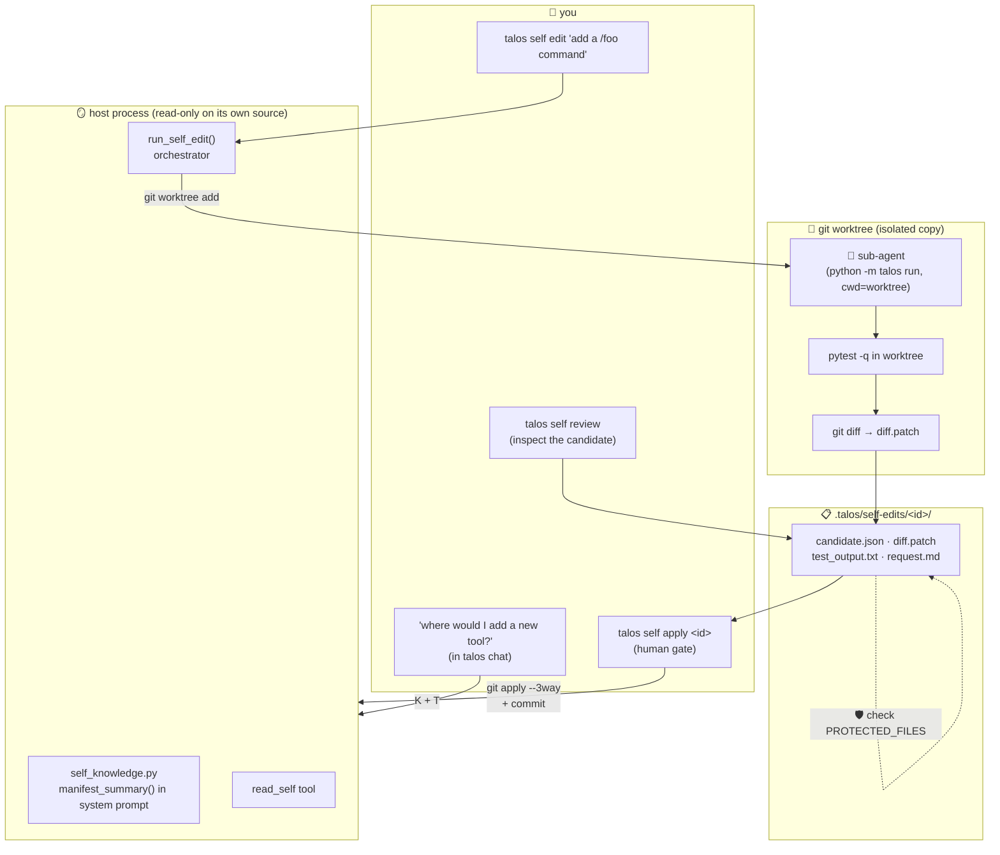

# 17 · 🪞 Self-knowledge & self-modification

> Files: `lifecycle/self_knowledge.py`, `lifecycle/self_edit.py`, `tools/self_tool.py`, `cli.py` (the `self` sub-typer) · Milestones: M52–M54

The Talos source tree had been opaque to Talos itself. M52–M54 close
the loop: the agent now (a) knows what's in its own codebase by
looking, and (b) can propose changes to it through a sandboxed,
test-gated, verifier-judged, human-approved flow.

## 🗺️ The shape of it



## 🪞 Self-knowledge (M52)

Every Talos module starts with an emoji-prefixed docstring describing
its purpose (a habit you've already been keeping — read any file in
`src/talos/` to see it). `walk_source()` AST-parses each file, pulls
the first sentence of that docstring, groups by subpackage, and
produces a `ModuleFact` list. Two surfaces:

- **Compact index in the system prompt.** `manifest_summary()` formats
  the list as Markdown with a token budget; `agent/context.py` slots it
  in next to `skills_summary()` and `agents_summary()`. Every turn the
  agent sees something like:

  ```
  ## Self-knowledge (Talos's own source tree)
  **memory/** (5 files):
  - src/talos/memory/sessions.py — 💾 Conversations that survive a restart.
  - src/talos/memory/compaction.py — 🗜️ Fold older turns into a summary.
  …
  ```

  "Where would I add a new tool?" is now answered without grepping.

- **`read_self` tool.** When the agent needs the *full* body of one
  module, it calls `read_self("memory/sessions.py")`. Same lazy pattern
  as `load_skill`. Paths are validated up front (no `..`, no absolute
  paths) — the tool can't be tricked into reading `/etc/passwd`.

The manifest persists at `.talos/self/manifest.json` and auto-
regenerates when any source file is newer than the cache.

## 🔧 The self-edit sandbox (M53)

The hard problem isn't editing — it's editing *safely*. A self-edit
that breaks the editor is unrecoverable. The architecture answers
that by making the editor and the editee different *processes*
working on different *files*.

```
talos self edit "add a /foo command"
         │
         ▼
┌────────────────────────────────────────────────┐
│ host process (read-only on its own src/)       │
│   ├── git worktree add /tmp/talos-edits/<id>   │
│   │   ↑ a fresh checkout, separate working dir │
│   ├── subprocess: python -m talos run "<req>"  │
│   │   cwd = the worktree                       │
│   │   ↑ the SUB-AGENT — it can do anything,    │
│   │     but only inside the worktree           │
│   ├── git -C <worktree> diff → diff.patch      │
│   ├── pytest -q in the worktree                │
│   └── persist to .talos/self-edits/<id>/       │
└────────────────────────────────────────────────┘
```

The host process never opens any file in `src/talos/` for writing.
The sub-agent runs with `--yolo` (no per-tool gate) because the
*worktree boundary* IS the safety perimeter — the worst the sub-agent
can do is dirty its own scratch directory, which we delete.

Every filesystem and process boundary in `run_self_edit()` is an
injectable callable (`create_worktree_fn`, `sub_agent_fn`, `diff_fn`,
`test_fn`, `cleanup_worktree_fn`, `verifier_fn`). Production binds
them to git/subprocess; offline tests stub them. That's how
`tests/test_self_edit.py` runs the whole orchestrator without ever
touching git or spawning a real LLM.

## 🛡️ Meta-protection (M54)

A self-edit that silently disables the gate that's supposed to catch
it is the worst-case failure. `PROTECTED_FILES` is the smallest
allowlist that prevents that:

```python
PROTECTED_FILES = frozenset({
    # the safety machinery itself
    "src/talos/infra/policy.py",
    "src/talos/infra/permissions.py",
    "src/talos/infra/sandbox.py",
    # scheduling — a hostile self-edit could plant a malicious schedule
    "src/talos/lifecycle/scheduling.py",
    # the self-edit code (meta — protect the protector)
    "src/talos/lifecycle/self_edit.py",
    "src/talos/lifecycle/self_knowledge.py",
    "src/talos/tools/self_tool.py",
    # the tests for self-edit (so a bad edit can't disable its own gate)
    "tests/test_self_edit.py",
    "tests/test_self_knowledge.py",
})
```

Violations are recorded on the candidate at orchestration time and
the reviewer sees them in `talos self review`. `talos self apply`
refuses to merge a candidate that touches any protected file unless
you pass `--force` — and even then, expects you to have read each
diff first. The list lives in code so it's auditable; expanding it
is a single PR.

## 🔍 The verifier

After tests pass, an LLM call scores the diff against the original
request:

```
{"passes_request": true|false,
 "evidence": "...",
 "concerns": [...],
 "recommendation": "approve" | "revise" | "reject"}
```

This is the same judge pattern Talos already uses in `/plan`
verification (M37). The verifier is skeptical by design — diffs that
pass tests but touch files the request never mentioned get flagged as
scope creep; diffs that disable a safety check get flagged as
concerns. A verifier crash or a chatty/garbage LLM reply defaults to
`recommendation: "revise"` so the gate stays cautious.

`talos self apply` refuses to merge a candidate whose verifier
recommendation is `reject`.

## 🧩 Applying a candidate

```bash
talos self review                   # list candidates
talos self review <id> --diff       # see one in detail (with diff and tests)
talos self apply <id>               # human gate, then git apply + commit
```

`apply_candidate()` calls `git apply --3way --index` so a clean
content-level merge happens automatically when `main` has moved since
the candidate was produced. On success the candidate's `applied` flag
is flipped (you can't apply the same candidate twice), a `self-edit
(<id>): <request>` commit lands on `main`, and the CLI tells you to
**restart any running Talos process** — the on-disk code may no longer
match what's in memory.

## 🪟 What's NOT in here (and why)

- **Auto-apply.** Even when tests pass and the verifier says approve,
  application requires a human `y`. "Tests pass" doesn't equal
  "intent met". The whole flow exists to give the human a small,
  reviewable surface; auto-merge undoes that.
- **Recursive self-edits.** No special support for the agent
  triggering another self-edit from inside a self-edit. Drift is real,
  and stacking changes you haven't reviewed is how you end up
  unrecoverable.
- **Live code reload.** A self-edit means restart Talos. Hot-swapping
  module code mid-conversation is a footgun for a system carrying
  asyncio tasks and an open session.

## 🧪 Testing

`tests/test_self_knowledge.py` (16 cases) covers walking, package
attribution, cache freshness, the read_self tool, and the system-
prompt wiring. `tests/test_self_edit.py` (22 cases) stubs every
boundary in `run_self_edit()` so the orchestration — cleanup on
crash, empty diff skips tests, verifier called only when there are
changes, garbage LLM defaults to revise, protected violations
recorded, apply refusals — is exercised without ever calling git or
spawning a process. The git/subprocess wiring is intentionally
verified by running the feature itself rather than mocking
`subprocess.run`.
