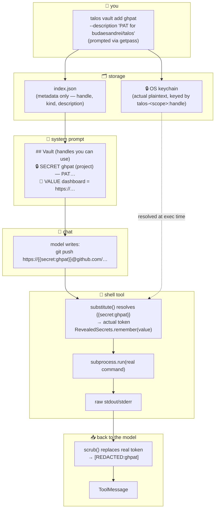

# 18 · 🔐 The vault: secrets and scoped values by handle

> Files: `infra/vault.py`, `tools/vault_tool.py`, `tools/shell.py`, `agent/context.py`, `cli.py` (the `vault` sub-typer) · Milestones: M55–M57

Some things shouldn't reach the LLM. API keys, database connection
strings, OAuth tokens — anything that, if it ended up in a tool result
that became a message that became part of the next prompt that became
part of a future trace export, would be a Bad Day. The vault is Talos's
answer: the model uses values by *handle*, never by *value*. The
plaintext never enters its context window.

The same store doubles as a convenient place to keep non-sensitive
references (your prod dashboard URL, your team's GitHub org, the
account ID you keep retyping). Those *do* go into the system prompt
since they're not sensitive — they just save you from copy-pasting.

## 🗺️ The shape of it



The model only ever sees the placeholder going in (`{{secret:ghpat}}`)
and the scrubbed output coming back (`[REDACTED:ghpat]` wherever the
token leaked into stdout). The plaintext lives in the OS keychain at
rest and exists in Python memory for the few microseconds between
`substitute()` and `subprocess.run`.

## 🧱 Three scopes, first-hit wins

The lookup order is `session → project → global`. Same idea as
`git config --local/--global` or shell env vars: a more specific
scope shadows a more general one.

* **session** — in-memory, this REPL process only. Lost on exit.
  Use case: a one-time PAT you're testing with, an override of a
  project secret you want to override for one session.

* **project** — `.talos/vault/index.json` in cwd, keyring entries
  namespaced by a hash of the project's absolute path. Use case:
  *this app's* prod connection string. Travels with the repo
  (gitignored); the namespacing means two repos with the same
  `github_pat` handle don't collide.

* **global** — the cross-platform user config dir (resolved as
  `TALOS_HOME` env var if set, then `%APPDATA%/talos` on Windows,
  `$XDG_CONFIG_HOME/talos` on POSIX if set, else `~/.talos`). Use
  case: *your personal* GitHub PAT, available everywhere.

This is the first feature to establish `~/.talos/` as a first-class
global config dir — Talos was project-local-only before M55. Future
features (global skills, default model preference, cross-project
memory) can use the same dir.

## 🔒 Two kinds: SECRET vs VALUE

* **SECRET** — the value lives in the OS keychain. The on-disk
  `index.json` carries metadata only (handle, kind, description).
  The system prompt shows the description, never the value. The
  model uses the value through `{{secret:handle}}` substitution
  in a shell command or code block — the shell tool resolves the
  placeholder at exec time.

* **VALUE** — non-sensitive. Stored directly in `index.json`,
  inlined in the system prompt. The model can quote or reference
  it without a tool call, and `vault_get(handle)` is also available
  for explicit lookup.

The model isn't asked to police itself: opacity is enforced
structurally by where the value lives.

## 🔁 Substitution: how the model uses secrets

The model writes a normal shell command with placeholders:

```
mongo "{{secret:prod_mongo_uri}}" --eval "db.users.count()"
```

The `shell` tool calls `substitute()` on the command before
`subprocess.run`. The regex matches `{{secret:<handle>}}` and
`{{value:<handle>}}` (the kind prefix is mandatory so the substitution
fails loud if you ask for the wrong shape). Unknown handles are
*left in place* rather than replaced with empty string — the
command runs with the literal placeholder, fails visibly, and the
tool output is prefixed with a `⚠️ unresolved vault placeholders: ...`
line so the model sees and adapts.

For tools that read env vars (psql via `PGPASSWORD`, aws via
`AWS_SECRET_ACCESS_KEY`), the standard pattern is to put the
placeholder in an `env` prefix:

```
env PGPASSWORD={{secret:prod_db_password}} psql -h prod.example.com -U admin
```

## 🧼 Scrubbing: the second line of defense

What if a tool output happens to contain a known secret value?
For example, `cat .env` or a stack trace that includes the
connection string. The vault keeps a process-scoped registry of
`RevealedSecrets` — every value `substitute()` resolves gets
remembered. The graph builder's `tools_node` calls
`RevealedSecrets.scrub()` on every tool output before it becomes a
`ToolMessage`. Known values get replaced with `[REDACTED:handle]`.

Two implementation details worth knowing:

1. **Length floor of 4 characters.** Values shorter than 4 chars
   aren't registered — otherwise a 3-char "secret" would match
   every other word in tool output.

2. **Longer-first matching.** When secret A is a substring of
   secret B, B replaces first. Otherwise A would partially redact
   B, corrupting the second match.

**Honest disclaimer.** Scrubbing is defense against *accidents*,
not against an *adversarial* model. A model can trivially
base64-encode a secret to bypass the literal-match scrubber. This
is the same realistic posture every secrets manager has — the
defense in depth is:

* keep secrets out of the prompt entirely (opacity via storage)
* enforce structural boundaries at tool exec time (substitution)
* scrub honest leaks on the way back (scrubber)
* protect the vault code itself from self-edit (PROTECTED_FILES)

There's no fourth layer that defends against a sufficiently
motivated model. The vault's threat model is "the model is honest
but might accidentally print a secret it had no business
printing." Most real-world leaks fit that shape.

## 🛡️ Meta-protection

The vault code is on the self-edit `PROTECTED_FILES` allowlist:

```python
"src/talos/infra/vault.py",
"src/talos/tools/vault_tool.py",
"tests/test_vault.py",
```

A `talos self edit` candidate that touches any of these is refused
at apply time unless you pass `--force`. Without this, a confused
self-edit could disable scrubbing or rewrite substitution and
quietly compromise every future secret.

## ✍️ Usage

Add a secret (prompted via `getpass` — never enters argv or shell
history):

```bash
talos vault add ghpat --description "PAT for budaesandrei/talos"
```

Other input modes for scripting:

```bash
talos vault add ghpat --from-env GITHUB_PAT --description "..."
echo "$TOKEN" | talos vault add ghpat --from-stdin --description "..."
```

A non-sensitive value:

```bash
talos vault add dashboard --kind value \
  --value "https://dash.example.com/prod" \
  --description "prod dashboard"
```

List, show, remove:

```bash
talos vault list                         # all scopes
talos vault list --scope project
talos vault show ghpat                   # metadata only for secrets
talos vault reveal ghpat                 # prints plaintext (with y/N gate)
talos vault remove ghpat --scope project
```

In chat, `/vault` lists handles and shows the current scrubber state.

## 🚫 What this is NOT

A few non-goals, because conflating them is how good local tools
become bad replicas of enterprise tools:

* **Not a team-shared secrets manager.** Use real Secrets Manager,
  Vault by HashiCorp, 1Password, or your cloud's equivalent for
  anything shared, audited, or rotated.
* **Not an audit log.** The vault doesn't record who accessed
  what. The OS keychain logs access on macOS only.
* **Not a rotation system.** No expiry, no automatic rolling. You
  rotate by `vault remove` + `vault add`.
* **Not a sharing format.** No export/import (intentional — a
  shared secrets-manager solves that better).

It's a local agent vault — the analog of your shell's `~/.netrc`
plus structure, not the analog of your org's Secrets Manager.

## 🧪 Testing

`tests/test_vault.py` is 38 cases (M55+M56+M57): CRUD across scopes,
the scope chain, project-namespacing across cwds, secret values
NEVER appearing in on-disk index, vault_get refusing secrets,
substitution happy paths and kind-mismatches and missing-handle
behavior, scrub idempotence + length-floor + longer-first ordering,
system-prompt projection, the shell-tool end-to-end smoke test,
and the cross-platform `global_dir` resolution including the
`TALOS_HOME` override + XDG/APPDATA. Every test runs with an
in-memory backend and an isolated HOME so no real keyring or
config dir is touched.
