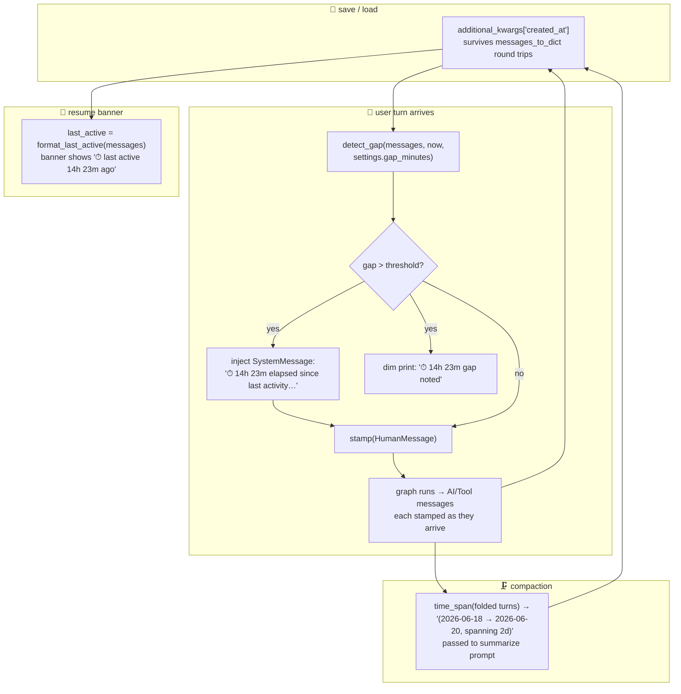

# 19 · ⏱ Time-awareness

> Files: `agent/time_awareness.py`, `agent/runtime.py`, `memory/compaction.py`, `ui/banner.py` · Milestones: M58

Talos has always known *what time it is now* — `agent/context.py`
injects `today's date: YYYY-MM-DD` into the system prompt every turn.
What it didn't know, until M58, is *how long since you last spoke*.
Resuming yesterday's session looked identical to typing thirty seconds
ago, which produced the occasional "wait, you don't know it's been 14
hours?" moment that erodes trust.

The fix is small and structural: every message carries a timestamp,
gaps are detected when a new turn arrives after a real pause, and the
model gets a brief one-line note so its first response acknowledges the
gap rather than pretending the conversation is contiguous.

## 🗺️ The shape of it



## 🧷 Per-message timestamps

The format choice — `additional_kwargs['created_at']` on each
`BaseMessage` — is LangChain's idiomatic extension point. It survives
the `messages_to_dict` / `messages_from_dict` round-trip that
`memory/sessions.py` uses on save/load, so timestamps come back intact
when you `talos chat -r latest` a week-old session.

```python
from talos.agent.time_awareness import stamp, timestamp_of

m = HumanMessage(content="hello")
stamp(m)
m.additional_kwargs["created_at"]  # '2026-06-19T10:30:00'
timestamp_of(m)                    # datetime(2026, 6, 19, 10, 30)
```

`stamp()` is **idempotent**. The first stamp wins; a second call leaves
the original time untouched. This matters because messages get loaded
from disk, re-saved, sometimes folded into compaction summaries — and
the *original* creation time has to survive all of it. Subtle but
load-bearing.

Old sessions without timestamps load cleanly; they simply don't trigger
gap detection until they accumulate fresh stamped messages. There's no
migration step.

## ⏰ Gap detection

A "gap" is the wall-clock distance between the most-recent stamped
message and `now`. When it exceeds `settings.gap_minutes` (default 30,
tunable via `TALOS_GAP_MINUTES`, set to 0 to disable), `Runtime.turn()`
prepends a brief `SystemMessage` to the conversation:

```
⏱ 14h 23m elapsed since last activity. Context may be stale — confirm
with the user if 'today', 'yesterday', or 'the last thing we did'
could be ambiguous now.
```

The notice is tagged via `additional_kwargs['kind'] = 'gap_notice'` so
tooling can filter or surface them later. `is_gap_notice(msg)` is the
predicate.

Awareness is **symmetric**: the model sees the SystemMessage in its
context, AND the user sees a dim one-line `⏱ 14h 23m gap noted`
printed to the terminal. The user knows that the agent knows.

## 💾 Resume awareness

When `talos chat -r latest` loads a session with stamped messages, the
banner gets an extra line:

```
model gpt-4o-mini · session 20260618-093000 · 💾 24 messages · ⏱ last active 14h 23m ago
```

You see the gap before you type your first message. No more "wait, was
this thread from yesterday or three days ago?" guessing.

## 🗜️ Time-aware compaction

When the conversation grows past the `compact_at` threshold, older
turns get folded into a summary `SystemMessage`. Without time-awareness,
that summary lost all temporal information — the model couldn't tell if
the folded turns happened ten minutes apart or a week apart.

M58 passes the time-span of the folded turns to the summarize callable
as a third argument:

```python
async def _summarize(self, prior: str, transcript: str, span: str = "") -> str:
    span_line = f"Time span of these turns: {span}\n\n" if span else ""
    msg = await build_llm(...).ainvoke([
        SM(content=SUMMARY_PROMPT),
        HM(content=f"{span_line}New turns to fold in:\n{transcript}"),
    ])
```

The model then writes a digest that naturally mentions the span ("These
turns spanned 2 days, mostly debugging the auth flow on Tuesday before
shipping the fix Wednesday morning"). Compaction stays backwards
compatible — older two-argument summarize callables still work via a
`TypeError` fallback in `compact()`, so existing callers don't break.

## 🧭 Design notes worth knowing

**Threshold tuning matters more than threshold value.** 30 minutes is
the default because it captures the lunch-break / meeting-came-up /
went-home-for-the-day cases without firing on every normal back-and-
forth. Setting it too low produces noise (every 5-minute pause becomes
a SystemMessage); too high misses real gaps. If you find yourself
ignoring the notice every time, raise the threshold.

**Stamping happens at message materialization, not at session save
time.** `Runtime.turn()` stamps the `HumanMessage` as it constructs it,
and stamps every `AIMessage` / `ToolMessage` as they arrive in the
`updates` stream from LangGraph. Stamping at save time would assign
the same timestamp to every message in a turn, which loses the within-
turn ordering information.

**Idempotency is the load-bearing property.** If `stamp()` ever
overwrote an existing timestamp, every compaction/resume cycle would
reset creation times to "now" and gap detection would be permanently
broken. The tests assert this directly.

**The injection is brief on purpose.** The model just needs to know
the gap exists; it doesn't need a paragraph. Over-instructed prompts
produce over-acting responses ("WELCOME BACK!!! it's been so long!!").
One-line, factual, with a hint about ambiguous referents.

## 🪞 What this is NOT (yet)

A few non-goals worth being explicit about:

* **Not a scheduling system.** Time-awareness reads the clock; the
  scheduling system (M49–M51) writes recurring tasks against it. They
  pair naturally — a scheduled run logs a stamped record, and the
  next chat sees both the run and the gap — but they're separate
  mechanisms.

* **Not a timezone solver.** Stamps are in the agent process's local
  time. A future `TALOS_TZ` could let you display in a different zone,
  but cross-machine timezone handling is out of scope for M58.

* **Not stale-content invalidation.** The gap notice tells the model
  the conversation paused; it doesn't tell the model that any specific
  fact has changed. The model is expected to ask if a referent feels
  ambiguous, not assume invalidation.

## 🧪 Testing

`tests/test_time_awareness.py` is 25 cases. Stamping (idempotency,
missing additional_kwargs, all-at-once); detection (threshold honored,
zero-disables, latest-message-wins, empty/unstamped → None); formatting
(`14m`, `2h 15m`, `1d 4h 30m`, "just now" floor); time_span and
format_span; gap_notice produces a tagged SystemMessage; round-trip
through `messages_to_dict`; compaction integration (span passed,
backwards-compat for two-arg summarize). Every test uses an injected
`now` so no test depends on wall-clock time.
