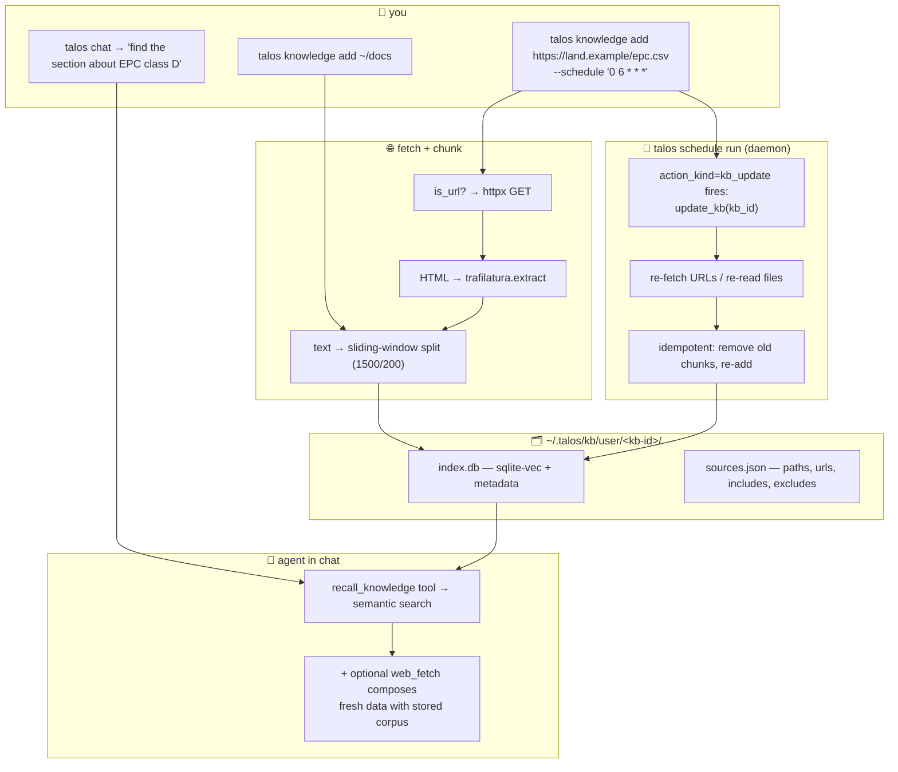

# 22 · 🗂 /knowledge: files, URLs, and scheduled re-indexing

> Files: `lifecycle/knowledge_cli.py`, `lifecycle/scheduling.py` (action_kind), `tools/knowledge_tool.py`, `cli.py` (the `knowledge` sub-typer) · Milestones: M63–M65

Pre-M63, the only way to give Talos reference material at chat time
was a curated SKILL.md or a permission-gated `read_file`. M63 brings
kiro-style `/knowledge` — point at a directory, get semantic search
over its contents. M64 extends sources to URLs (raw + HTML), and M65
pairs the existing scheduler with KB re-indexing so an authoritative
external dataset can stay fresh automatically.

The combination produces a pattern that no other agent CLI ships with
out of the box: a self-updating knowledge corpus the agent can query
in natural language.

## 🗺️ The shape of it



## 🗂 Local files and dirs (M63)

```
talos knowledge add ~/docs/api --name api-docs
talos knowledge add ~/repo --include "**/*.md" --exclude "node_modules/**"
talos knowledge show                    # list every user KB
talos knowledge show api-docs           # show one KB's sources + chunk count
talos knowledge update api-docs         # re-index from disk
talos knowledge search "auth refactor"  # cross-KB search
talos knowledge remove api-docs
talos knowledge clear --yes             # nuclear option
```

`/knowledge` in chat lists user KBs as a table (management lives in
the CLI for write-action visibility).

**File-type support** matches kiro's set — text, code, markdown,
JSON/YAML/TOML configs, CSV/TSV data, plus extension-less special
files (`Dockerfile`, `Makefile`, `LICENSE`, `CHANGELOG`, `README`).
Binary files are ignored. The full list lives in
`SUPPORTED_EXTENSIONS` / `SUPPORTED_BASENAMES` if you need to grow it.

**Glob patterns** (`--include`, `--exclude`) use Python's `fnmatch`,
which doesn't have glob's `**` recursive semantics natively. We
expand patterns so `**/*.py` also matches top-level `*.py` — the
"works like you'd expect" behavior. Both patterns can be repeated:

```
talos knowledge add ~/code --include "**/*.rs" --include "**/*.md" \
                            --exclude "target/**" --exclude "**/build/**"
```

**Idempotency** at the source level — re-adding the same path drops
its prior chunks first. Means `update_kb` is safe to call after you've
edited a file, and `add_kb name=foo path=docs/` is safe to re-run.

**Storage** under `~/.talos/kb/user/<kb-id>/`:
- `index.db` — the sqlite-vec index (from the M60 KB primitive)
- `kb.json` — KB metadata (name, kind, embedder + dim, created_at)
- `sources.json` — manifest of every source ever added + the
  include/exclude patterns each was added with (so update_kb can
  faithfully re-apply them)

Crucially, `kb_root_user()` is a separate directory from where
`SessionsKB` lives. `talos knowledge show` only lists user-set KBs;
sessions stay in their own surface (`talos sessions search`).

## 🌐 URL sources (M64)

`talos knowledge add` accepts http(s) URLs alongside local paths.
The path-vs-URL branch happens inside `add_kb` — anything matching
`^https?://` goes through `fetch_url`:

```python
def fetch_url(url, *, headers=None, timeout=30):
    headers = _substitute_headers(headers or {})
    headers.setdefault("User-Agent", "Talos/1.0 (knowledge-base ingest)")
    resp = httpx.get(url, headers=headers, timeout=timeout,
                      follow_redirects=True)
    resp.raise_for_status()
    if "html" in resp.headers.get("content-type", "").lower():
        return _html_to_text(resp.text, url)
    return resp.text
```

For HTML, `trafilatura` strips navigation, footer, and other chrome
so the chunked text is article-like rather than full-page noise.
Trafilatura's output is `None` if the page has no extractable
article structure (rare for real content); the fallback is a naive
regex tag-strip so something always comes back.

**Vault auth headers** — `_substitute_headers` runs each header value
through `vault.substitute`, so private-URL ingestion works without
leaking the secret into chat:

```
talos vault add gitlab_token --description "GitLab read-only API token"
talos knowledge add https://gitlab.example.com/api/v4/projects/42/repository/files/README.md/raw \
                    --name gitlab-readme
# ...and then in your headers config (M65 has a way to pair this),
# Authorization: Bearer {{secret:gitlab_token}}
```

The substitution happens at fetch time — the model isn't in the loop
during `talos knowledge add`, so opacity isn't violated even though
substitution succeeds.

**Idempotency** works the same as files: re-adding the same URL drops
its prior chunks, then re-fetches. The sources manifest records
`kind: "url"` so `update_kb` knows to re-fetch instead of re-read
from disk.

## 📅 Scheduled re-indexing (M65)

The real reason URL support pays off — pair a KB with a schedule and
the corpus stays fresh on its own. `Schedule.action_kind` is a new
enum field:

| `action_kind` | What fires | Required fields |
|---|---|---|
| `prompt` (default) | `Runtime.turn(prompt)` — existing behavior | `prompt` |
| `kb_update` | `update_kb(kb_id)` — re-ingest every source | `kb_id` |

`fire_schedule` dispatches on `action_kind`. No LLM call for a
`kb_update` fire (cheap) — just a re-fetch + re-chunk + re-embed pass.

The ergonomic create-pair flow:

```
talos knowledge add https://land.example.gov.uk/epc/full-export.csv \
                    --name epc \
                    --schedule "0 6 * * *"
```

This single command:
1. Fetches the URL once, chunks it, indexes into KB `epc`
2. Creates a schedule `kb-update-epc` with `action_kind=kb_update`,
   `kb_id=<the epc kb's id>`, `cron=0 6 * * *`
3. Prints the next three fire times so you can sanity-check

Now `talos schedule run` (the daemon from M49-M51) wakes daily at
6am, refreshes the EPC index, and the agent can answer questions
against currently-fresh data without you doing anything.

`--schedule` accepts both cron and natural language (e.g.
`"every morning at 9"`) via the M50 NL→cron parser.

## 🤖 Agent surface

Five tools for natural-language management:

* `recall_knowledge(query, k=5, kb=None)` — search across user KBs
  (or one specific KB). Lower score = better. Read-only.
* `list_kbs_tool()` — JSON listing of user KBs. Read-only.
* `add_kb_tool(name, path, include, exclude)` — write (KB content is
  not sensitive the way vault is, so writes are OK here per the M66
  "all-tools-as-natural-language" design).
* `update_kb_tool(kb_id_or_name)` — write (re-ingest).
* `remove_kb_tool(kb_id_or_name)` — write (delete).

The agent can now answer "what does my codebase say about X?" by
calling `recall_knowledge(query=X, kb="codebase")` directly, with no
file-by-file grep loop and no permission gate friction (the index was
created by you).

## 🧩 The property-advisor pattern

The combination M63 + M64 + M65 unlocks a useful concrete pattern:
**agent-as-continuous-advisor**.

```
# One-time setup
talos vault add zoopla_key --description "Zoopla API key"
talos knowledge add https://land-registry.example/epc-table.xlsx \
                    --name epc --schedule "0 6 * * *"

# Daemon runs forever (or under systemd/launchd)
talos schedule run
```

Now in chat:

```
> find me 10 properties in SW8 in my budget and tell me which would
> be cheapest to renovate to EPC B

[agent calls web_fetch against Zoopla with the vault'd key]
[agent calls recall_knowledge("SW8 EPC ratings", kb="epc")]
[agent crosses the live property data with the daily-refreshed
 EPC dataset and produces a ranked list]
```

The agent is composing on-demand web lookups with stored, scheduled-
fresh knowledge. The EPC dataset is the authoritative bottleneck;
the daily re-index keeps it current; the agent reasons over both.

No other agent CLI ships this combination today — kiro has
`/knowledge` but no scheduler; agent CLIs with schedulers don't have
KB primitives. The composition is the differentiator.

## 🧪 Testing

- `tests/test_knowledge_cli.py` — 25 cases on M63 (file discovery,
  add/remove/list, update, search, agent tools, dispatch)
- `tests/test_knowledge_urls.py` — 12 cases on M64 (URL detection,
  fetch+index with stub fetcher, manifest tracking, idempotent re-add,
  failure modes, vault header substitution, HTML extraction)
- `tests/test_kb_scheduled.py` — 7 cases on M65 (action_kind round-trip,
  fire dispatches kb_update, missing-KB error, missing kb_id error,
  prompt-kind schedules still work unchanged)

Every test uses `HashEmbedder`, an isolated `HOME`, and a stub fetcher
so no model, no network, no real config touched.

## 🪟 What's NOT here (deliberately)

- **Indexing the project's source tree as a KB by default.** That's
  what `read_self` (M52) covers — manifests + AST docstrings, no
  re-ingest needed because the source IS the truth.
- **Cross-KB ranking with reranking models.** Score is L2 distance
  from sqlite-vec. A two-stage rerank with a cross-encoder would
  improve precision; out of scope here.
- **Authentication for the *user* hitting the search API.** The KBs
  are local to your machine. No multi-user concerns.
- **An "agent saw something interesting and added a KB itself"
  workflow.** `add_kb_tool` exists, but the natural flow is still
  user-initiated `talos knowledge add`. Agent-initiated adds work
  but the spec deliberately doesn't push them.
